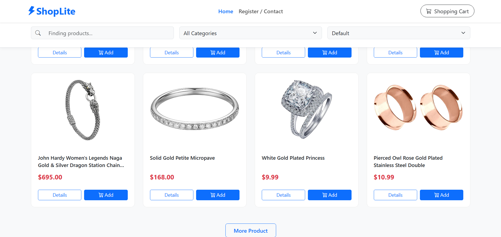
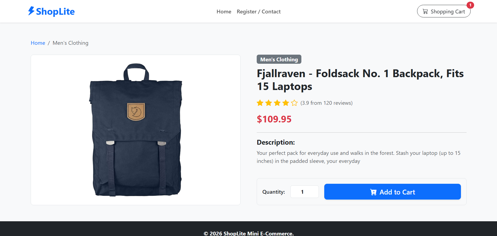
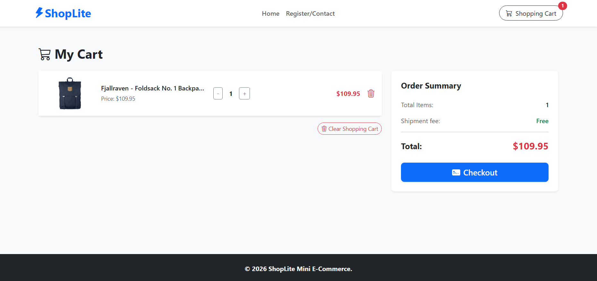
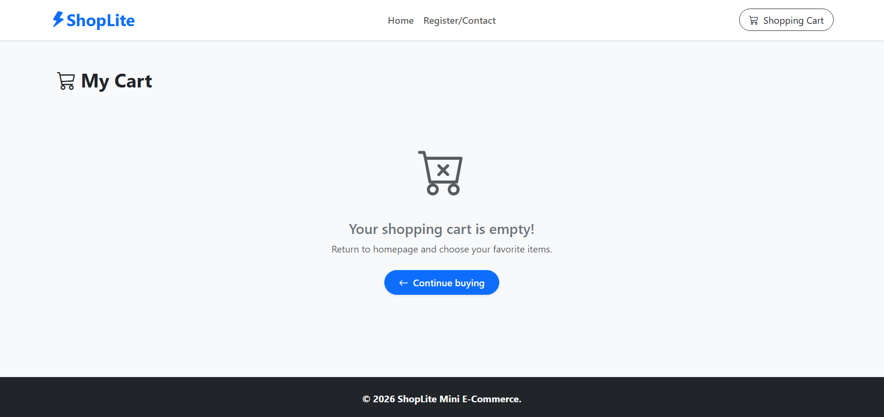
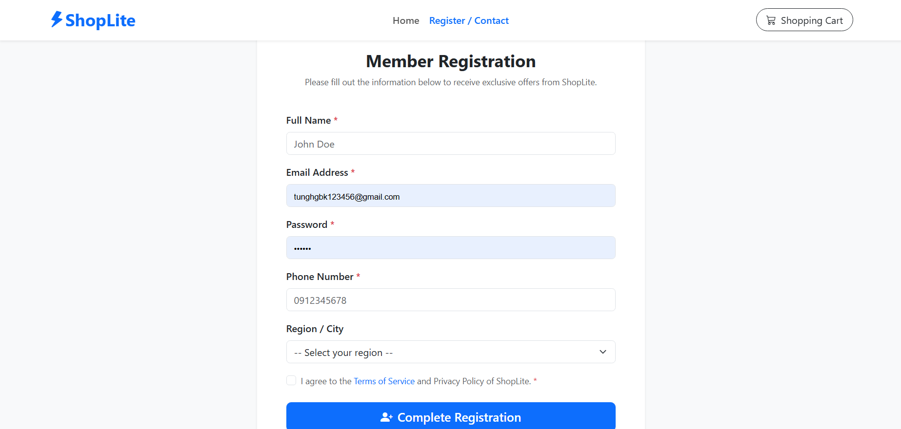

# ShopLite — Mini E-Commerce Application

A client-side e-commerce web app built with HTML5, CSS3, Vanilla JavaScript, Bootstrap 5, and the Fake Store API. No backend required.

---

## Short Description

ShopLite is a 4-page mini shopping website that fetches real product data from [Fake Store API](https://fakestoreapi.com/). Users can browse products, view details, add items to a persistent cart, and register as members.

---

## Screenshots

- **Home Page (`index.html`)** — Product listing with search, filter, sort, and lazy load.
  - *Hero Banner view:*
    
  - *Product Grid view:*
    

- **Product Detail (`product.html`)** — Detailed product specifications with synchronous rating stars.
  

- **Shopping Cart (`cart.html`)** — Fully persistent cart supporting live quantity alterations and mathematical totals.
  - _Cart with items:_
    
  - _Empty state view:_
    

- **Member Registration (`register.html`)** — Secure credential submission framework utilizing client-side validation logic.
  

---

## Local Run Instructions

No build tools required. Just open with a local server to avoid CORS issues.

**Option 1 — VS Code Live Server:**

1. Install the [Live Server](https://marketplace.visualstudio.com/items?itemName=ritwickdey.LiveServer) extension.
2. Right-click `index.html` → **Open with Live Server**.

**Option 2 — Python:**

```bash
cd fef_shoplite
python -m http.server 5500
```

Then open `http://localhost:5500` in your browser.

---

## Completed Features

### Pass Tier

- [x] 4 pages linked via a shared navbar (`index.html`, `product.html`, `cart.html`, `register.html`)
- [x] Semantic HTML: `header`, `nav`, `main`, `section`, `article`, `footer`
- [x] Home page fetches and renders product list dynamically from API (no hard-coded data)
- [x] Product detail page reads `?id=` from URL and fetches correct product
- [x] Registration form with JavaScript validation (name, email, password, phone, select, checkbox)
- [x] Responsive layout: mobile (≤576px), tablet, desktop; navbar collapses on mobile

### Good Tier

- [x] Full cart: add / increase / decrease quantity / remove item / clear all — persisted in `localStorage`
- [x] Real-time cart total and item count update
- [x] Search by product name + filter by category + sort by price — all combined simultaneously
- [x] Loading spinner while fetching; error alert on network failure; empty-state UI for cart
- [x] Hand-written Flexbox/Grid CSS in `style.css` with 3 responsive breakpoints

### Excellent Tier

- [x] **Event delegation** — single `click` listener on `#product-grid` handles all "Add to cart" buttons; single listener on `#cart-items` handles qty change and remove
- [x] **Sort** by price ascending/descending, combined with active search and filter
- [x] **Cart badge** on navbar synced across all pages via `localStorage`
- [x] **Load More** — products rendered in batches of 4, button hidden when all loaded
- [x] **Toast notification** on successful add-to-cart
- [x] **Debounce** on search input (300ms) to avoid excessive filtering on every keystroke

---

## Project Structure

```
fef_shoplite/
├── index.html          # Home — product listing
├── product.html        # Product detail
├── cart.html           # Shopping cart
├── register.html       # Member registration
├── css/
│   └── style.css       # Custom styles + responsive breakpoints
├── js/
│   ├── api.js          # Shared fetch functions (getAllProducts, getProductById, etc.)
│   ├── cart.js         # Cart logic + localStorage persistence
│   ├── home.js         # Home page: render, search, filter, sort, load more
│   ├── product.js      # Product detail page logic
│   └── register.js     # Form validation logic
├── assets/
│   └── hero.png        # Hero banner image
└── README.md
```

---

## Links

- **GitHub Repo:** `https://github.com/nutne88/fef-shoplite-tungnt188`
- **Live Demo:** `https://nutne88.github.io/fef-shoplite-tungnt188/`

---

_FEF Long Assignment · TungNT188 · 2026_
